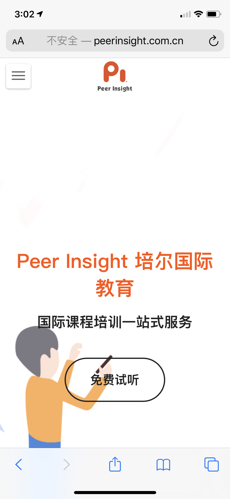
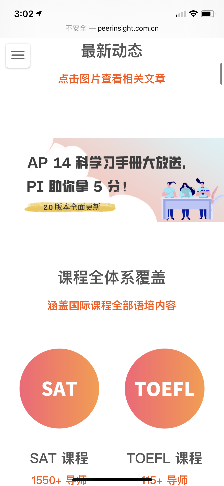
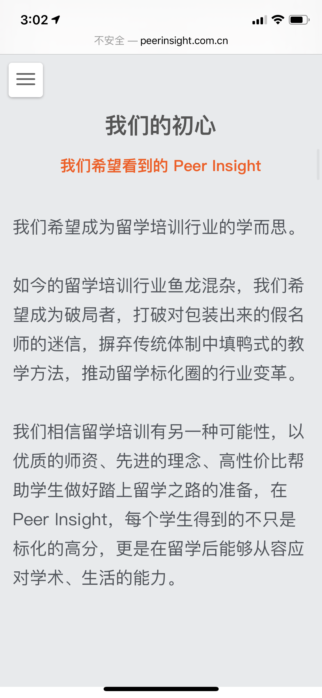
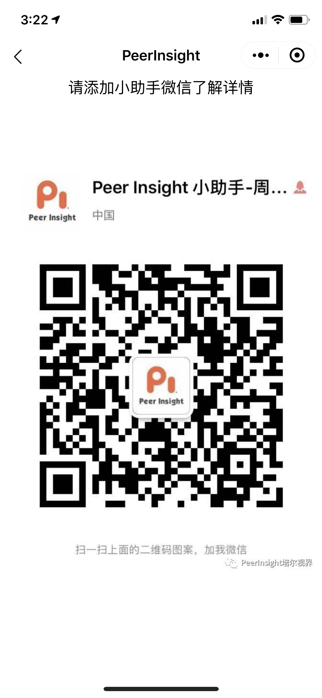
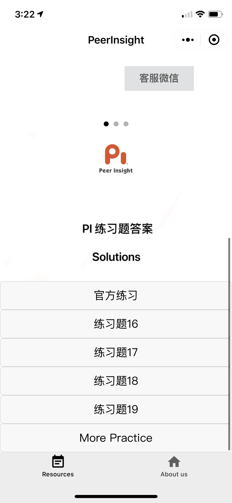
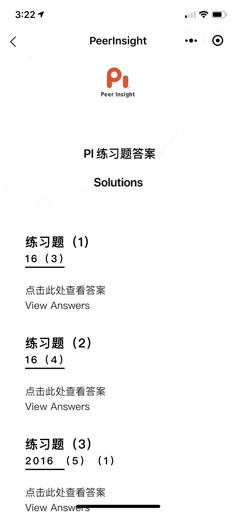
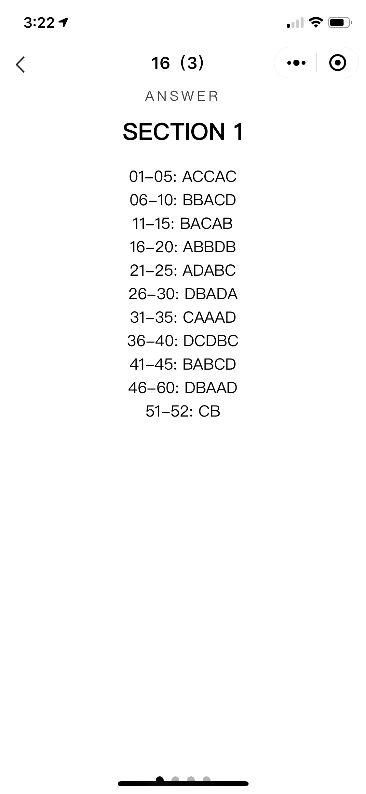

# Codes for PeerInsight Wechat MiniProgram
We wish to provide a MiniProgram for our startup education organization called PeerInsight.   
We primarily demand three functions.   
**(1)A tab that demonstrates our organization that is called "About Us", which navigates the user to our website (http://www.peerinsight.com.cn).**  

**(2)A brief introduction of the working staff within our organization in the form of slides.**. 

When clicking the lower right corner buttom "customer service", a code with the contact means of our agent will pop out.  

**(3)The solutions to the practice questions made by our organization categorized by different topics, modules within the topic, and sections within the modules.**   
You will first see solutions categorized to different topics.       

By clicking a specific topic, you will be led to solutions categorized to different modules within that specific topic.    

Each modules is divided into four sections and each section contains 30-60 practice problems answers.    

